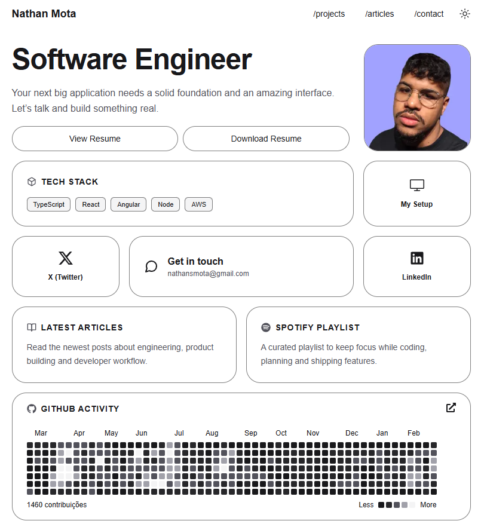

# Portfolio with Next 16

This is my portfolio built with Next 16.

If you liked it, just fork this project and fill in the `data/resume-data.tsx` file with your own information.

## How to Customize

- PDF Resume: place your file inside the `public/cv` folder.
- Projects: add your project images to the `public/projects` folder.
- Setup: add an image of your setup to the `public/setup` folder.

That’s it — you’re all set.

## License

This project is open-source and available under the MIT License.

Feel free to use it as inspiration for your own portfolio, customize it, and build something amazing. Just make sure to keep the original license notice.

## Preview

